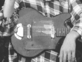

# Project: Lyrics Classifier / Lyrik Classifier

### Background

Websites like lyrics.com offer a vast amount of lyrics for all kind of musicians. Web scraping makes it possible to access these texts and use them for data analysis and predictions.

### Goal

The goal of this project is to build a Lyrics Classifier that predicts the artist of any given text input. For this texts are accumulated with the help of BeautifulSoup, preprocessed with spacy and then vectorized using TFIDF. Predictions are then made with a Naive Bayes model.

### Sources

This week consists of two subprojects. The first classifier is optimized for predicting Indie Rock Bands. 16875 songs by 558 artists are in the data set that is based on lyrics from lyrics.com.
The second classifier predicts german poets based on a data set of 15 german writers plus additional snippets from the telephone book, the official Windows 10 help and hummus recipes on Chefkoch.de.

### Files

Run the notebook in the 'lyrik_classifier' directory to test out the german poet classifier. The indie rock classifier is implemented as a command line program. Run 'explore_indie_bands.py' to test out.
