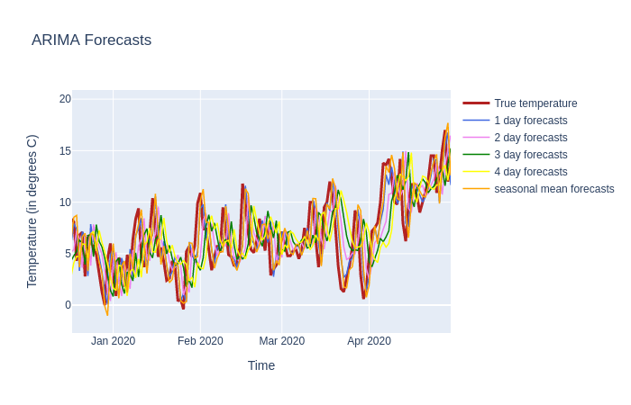

# Project: Temperature Forecast Berlin Tempelhof

### Background

Weather forecasting is a prime example for using time series data.

### Goal

* Implement Time Series Analysis
* Extract time dependence as good as possible
* Use ARIMA or Auto Regression model in order to predict future temperature values
* Use plotly for EDA

### Sources

Temperature data is used from the *European Climate Assessment & Dataset project* (https://www.ecad.eu/dailydata/index.php).
More precisely, daily average temperature data from the meterological station in Berlin Tempelhof (Longitude: 13.40°, Latitude: 52.47°, Height: 49 m) is used.

Alternatively, the *Deutscher Wetterdienst* (https://opendata.dwd.de/climate_environment/CDC/observations_germany/climate/daily/kl/) is offering latest and more detailed data.

### Files

Run the notebook to test out ARIMA model that uses a one week lag to give a four day forecast.
